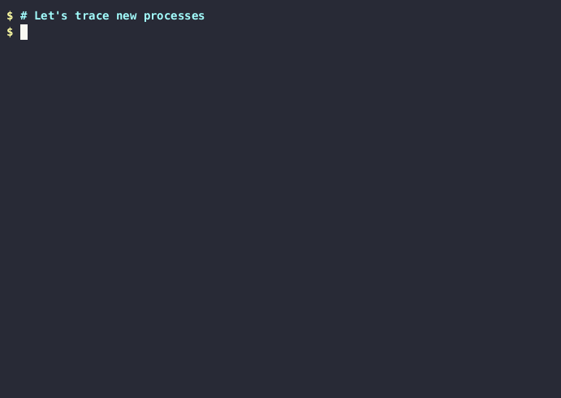

The trace exec gadget streams new processes creation events.

### On Kubernetes

Let's deploy an example application that will spawn few new processes:

```bash
$ kubectl apply -f docs/examples/ds-myapp.yaml
daemonset.apps/myapp1-pod created
daemonset.apps/myapp2-pod created

$ kubectl get pod --show-labels -o wide
NAME               READY   STATUS    RESTARTS   AGE     IP           NODE             LABELS
myapp1-pod-2gs5r   1/1     Running   0          2m24s   10.2.232.6   ip-10-0-30-247   myapp=app-one,name=myapp1-pod,role=demo
myapp1-pod-qnj4d   1/1     Running   0          2m24s   10.2.249.6   ip-10-0-44-74    myapp=app-one,name=myapp1-pod,role=demo
myapp2-pod-s5kvv   1/1     Running   0          2m24s   10.2.249.7   ip-10-0-44-74    myapp=app-two,name=myapp2-pod,role=demo
myapp2-pod-mqfxv   1/1     Running   0          2m24s   10.2.232.5   ip-10-0-30-247   myapp=app-two,name=myapp2-pod,role=demo

```

Using the trace exec gadget, we can see which new processes are spawned on node
ip-10-0-30-247 where myapp1-pod-2gs5r and myapp2-pod-mqfxv are running:

```bash
$ kubectl gadget trace exec --selector role=demo --node ip-10-0-30-247
K8S.NODE            K8S.NAMESPACE    K8S.POD          K8S.CONTAINER   PID     PPID    COMM            RET ARGS
ip-10-0-30-247      default          myapp1-pod-2gs5r myapp1-pod      728770  728166  date              0 /bin/date
ip-10-0-30-247      default          myapp1-pod-2gs5r myapp1-pod      728771  728166  cat               0 /bin/cat /proc/version
ip-10-0-30-247      default          myapp1-pod-2gs5r myapp1-pod      728772  728166  sleep             0 /bin/sleep 1
ip-10-0-30-247      default          myapp1-pod-2gs5r myapp1-pod      728802  728166  true              0 /bin/true
ip-10-0-30-247      default          myapp1-pod-2gs5r myapp1-pod      728803  728166  date              0 /bin/date
ip-10-0-30-247      default          myapp1-pod-2gs5r myapp1-pod      728804  728166  cat               0 /bin/cat /proc/version
ip-10-0-30-247      default          myapp1-pod-2gs5r myapp1-pod      728805  728166  sleep             0 /bin/sleep 1
ip-10-0-30-247      default          myapp2-pod-mqfxv myapp2-pod      728832  728052  true              0 /bin/true
ip-10-0-30-247      default          myapp2-pod-mqfxv myapp2-pod      728833  728052  date              0 /bin/date
ip-10-0-30-247      default          myapp2-pod-mqfxv myapp2-pod      728834  728052  echo              0 /bin/echo sleep-10
ip-10-0-30-247      default          myapp2-pod-mqfxv myapp2-pod      728835  728052  sleep             0 /bin/sleep 10
ip-10-0-30-247      default          myapp1-pod-2gs5r myapp1-pod      728836  728166  true              0 /bin/true
ip-10-0-30-247      default          myapp1-pod-2gs5r myapp1-pod      728837  728166  date              0 /bin/date
ip-10-0-30-247      default          myapp1-pod-2gs5r myapp1-pod      728838  728166  cat               0 /bin/cat /proc/version
ip-10-0-30-247      default          myapp1-pod-2gs5r myapp1-pod      728839  728166  sleep             0 /bin/sleep 1
ip-10-0-30-247      default          myapp1-pod-2gs5r myapp1-pod      728880  728166  true              0 /bin/true
ip-10-0-30-247      default          myapp1-pod-2gs5r myapp1-pod      728881  728166  date              0 /bin/date
ip-10-0-30-247      default          myapp1-pod-2gs5r myapp1-pod      728882  728166  cat               0 /bin/cat /proc/version
ip-10-0-30-247      default          myapp1-pod-2gs5r myapp1-pod      728883  728166  sleep             0 /bin/sleep 1
^C
Terminating...
```
Processes of both pods are spawned: myapp1 spawns `cat /proc/version` and `sleep 1`,
myapp2 spawns `echo sleep-10` and `sleep 10`, both spawn `true` and `date`.
We can stop to trace again by hitting Ctrl-C.

Finally, we clean up our demo app.

```bash
$ kubectl delete -f docs/examples/ds-myapp.yaml
```

### With `ig`

Let's start the gadget in a terminal:

```bash
$ sudo ig trace exec -c test-trace-exec
RUNTIME.CONTAINERNAME                             PID        PPID       COMM             RET ARGS
```

Run a container that executes some binaries:

```bash
$ docker run --name test-trace-exec -it --rm busybox /bin/sh -c 'while /bin/true ; do whoami ; sleep 3 ; done'
```

The tool will show the different processes executed by the container:

```bash
$ sudo ig trace exec -c test-trace-exec
RUNTIME.CONTAINERNAME                             PID        PPID       COMM             RET ARGS
test-trace-exec                                   99081      99062      sh               0   /bin/sh -c while /bin/true ; do whoami ; sleep 3 ; done
test-trace-exec                                   99125      99081      true             0   /bin/true
test-trace-exec                                   99126      99081      whoami           0   /bin/whoami
test-trace-exec                                   99127      99081      sleep            0   /bin/sleep 3
test-trace-exec                                   99128      99081      true             0   /bin/true
test-trace-exec                                   99129      99081      whoami           0   /bin/whoami
test-trace-exec                                   99130      99081      sleep            0   /bin/sleep 3
```

### `--cwd`

This gadget provides the current working directory of the process calling `exec()`. This is disabled
by default and can be enabled by passing the `--cwd` flag:

```bash
$ sudo ig trace exec  --cwd

RUNTIME.CONTAINERNAME           PID        PPID       COMM              RET ARGS                                      CWD
mycontainer2                    287752     287360     mkdir             0   /bin/mkdir -p /tmp/bar/foo/               /
mycontainer2                    287897     287360     cat               0   /bin/cat /dev/null                        /tmp/bar/foo
```

### Overlay filesystem upper layer

It can be useful to know if the executable in a container was modified or part
of the original container image. If it was modified, it will be located in the
upper layer of the overlay filesystem. For this reason, this gadget provides
the upper layer field which is true if the executable is located in the upper
layer of the overlay filesystem.

```bash
$ sudo ig trace exec -c test -o columns=comm,ret,upperlayer
COMM             RET UPPERLAYER
sh               0   false
cp               0   false
echo             0   false
echo2            0   true
```

```bash
$ docker run -ti --rm --name=test ubuntu \
    sh -c 'cp /bin/echo /bin/echo2 ; /bin/echo lower ; /bin/echo2 upper'
lower
upper
```

Limitations:
- The upper layer field is only available when the executable is executed
 correctly (ret=0). For example, if the executable does not have the "execute"
 permission, the execution will fail and the upper layer field will not be
 defined.
- In case of a shell script, the upper layer field will refer to the location
 of the shell program (e.g. `/bin/sh`) and not the script file.