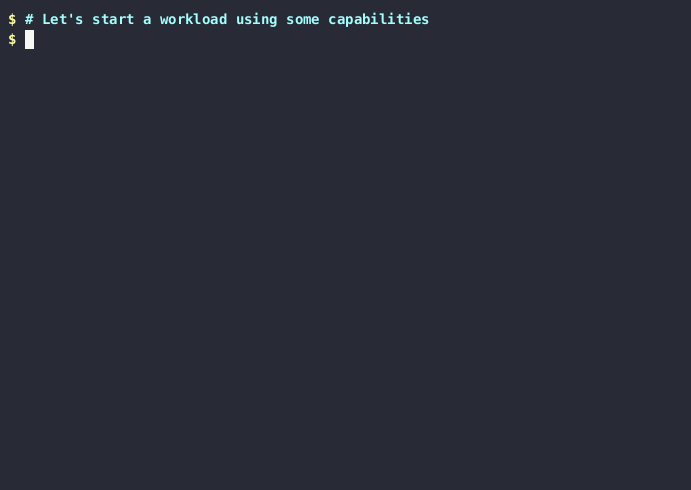

The trace capabilities gadget allows us to see what capability security checks
are triggered by applications running in Kubernetes Pods.

Linux [capabilities](https://linux.die.net/man/7/capabilities) allow for a finer
privilege control because they can give root-like capabilities to processes without
giving them full root access. They can also be taken away from root processes.
If a pod is directly executing programs as root, we can further lock it down
by taking capabilities away. Sometimes we need to add capabilities which
are not there by default. You can see the list of default and available
capabilities [in Docker](https://docs.docker.com/engine/reference/run/#runtime-privilege-and-linux-capabilities).
Specially if our pod is directly run as user instead of root (runAsUser: ID),
we can give some more capabilities (think as partly root) and still take all
unused capabilities to really lock it down.

### On Kubernetes

Here we have a small demo app which logs failures due to lacking capabilities.
Since none of the default capabilities is dropped, we have to find
out what non-default capability we have to add.

```bash
$ cat docs/examples/app-set-priority.yaml
apiVersion: apps/v1
kind: Deployment
metadata:
  name: set-priority
  labels:
    k8s-app: set-priority
spec:
  selector:
    matchLabels:
      name: set-priority
  template:
    metadata:
      labels:
        name: set-priority
    spec:
      containers:
      - name: set-priority
        image: busybox
        command: [ "sh", "-c", "while /bin/true ; do nice -n -20 echo ; sleep 5; done" ]

$ kubectl apply -f docs/examples/app-set-priority.yaml
deployment.apps/set-priority created
$ kubectl logs -lname=set-priority
nice: setpriority(-20): Permission denied
nice: setpriority(-20): Permission denied
```

We could see the error messages in the pod's log.
Let's use Inspektor Gadget to watch the capability checks:

```bash
$ kubectl gadget trace capabilities --selector name=set-priority
NODE             NAMESPACE  POD                     CONTAINER     PID      COMM  SYSCALL      UID  CAP CAPNAME   AUDIT  VERDICT
minikube-docker  default    set-priorit…495c8-t88x8 set-priority  2711127  nice  setpriority  0    23  SYS_NICE  1      Deny
minikube-docker  default    set-priorit…495c8-t88x8 set-priority  2711260  nice  setpriority  0    23  SYS_NICE  1      Deny
minikube-docker  default    set-priorit…495c8-t88x8 set-priority  2711457  nice  setpriority  0    23  SYS_NICE  1      Deny
minikube-docker  default    set-priorit…495c8-t88x8 set-priority  2711619  nice  setpriority  0    23  SYS_NICE  1      Deny
minikube-docker  default    set-priorit…495c8-t88x8 set-priority  2711815  nice  setpriority  0    23  SYS_NICE  1      Deny
^C
Terminating...
```

We can leave the gadget with Ctrl-C.
In the output we see that the `SYS_NICE` capability got checked when `nice` was run.
We should probably add it to our pod template for `nice` to work. We can also drop
all other capabilities from the default list (see link above) since `nice`
did not use them:

The meaning of the columns is:

* `SYSCALL`: the system call that caused the capability to be exercised
* `CAP`: capability number.
* `CAPNAME`: capability name in a human friendly format.
* `AUDIT`: whether the kernel should audit the security request or not.
* `VERDICT`: whether the capability was present (allow) or not (deny)

```bash
$ cat docs/examples/app-set-priority-locked-down.yaml
apiVersion: apps/v1
kind: Deployment
metadata:
  name: set-priority
  labels:
    k8s-app: set-priority
spec:
  selector:
    matchLabels:
      name: set-priority
  template:
    metadata:
      labels:
        name: set-priority
    spec:
      containers:
      - name: set-priority
        image: busybox
        command: [ "sh", "-c", "while /bin/true ; do nice -n -20 echo ; sleep 5; done" ]
        securityContext:
          capabilities:
            add: ["SYS_NICE"]
            drop: [all]

```

Let's verify that our locked-down version works.

```bash
$ kubectl delete -f docs/examples/app-set-priority.yaml
deployment.apps "set-priority" deleted
$ kubectl apply -f docs/examples/app-set-priority-locked-down.yaml
deployment.apps/set-priority created
$ kubectl logs -lname=set-priority

```

The logs are clean, so everything works!

We can see the same checks but this time with the `Allow` verdict:

```bash
$ kubectl gadget trace capabilities --selector name=set-priority
NODE             NAMESPACE  POD                     CONTAINER     PID      COMM  SYSCALL      UID  CAP CAPNAME   AUDIT  VERDICT
minikube-docker  default    set-priorit…66dff-nm5pt set-priority  2718069  nice  setpriority  0    23  SYS_NICE  1      Allow
minikube-docker  default    set-priorit…66dff-nm5pt set-priority  2718291  nice  setpriority  0    23  SYS_NICE  1      Allow
^C
Terminating...
```

You can now delete the pod you created:
```
$ kubectl delete -f docs/examples/app-set-priority-locked-down.yaml
```

### With local-gadget

Start local-gadget:

```bash
$ local-gadget trace capabilities -r docker -c test
CONTAINER  PID      COMM     SYSCALL  UID  CAP CAPNAME      AUDIT  VERDICT
```

Start the test container exercising the capabilities:
```bash
$ docker run -ti --rm --name=test --privileged busybox
/ # touch /aaa ; chown 1:1 /aaa ; chmod 400 /aaa
/ # chroot /
/ # mkdir /mnt ; mount -t tmpfs tmpfs /mnt
/ # export PPID=$$;/bin/unshare -i sh -c "/bin/nsenter -i -t $PPID echo OK"
OK
```

Observe the resulting trace:

```
CONTAINER  PID      COMM     SYSCALL  UID  CAP CAPNAME      AUDIT  VERDICT
test       2609137  chown    chown    0    0   CHOWN        1      Allow
test       2609137  chown    chown    0    0   CHOWN        1      Allow
test       2609138  chmod    chmod    0    3   FOWNER       1      Allow
test       2609138  chmod    chmod    0    4   FSETID       1      Allow
test       2609138  chmod    chmod    0    4   FSETID       1      Allow
test       2609694  chroot   chroot   0    18  SYS_CHROOT   1      Allow
test       2610364  mount    mount    0    21  SYS_ADMIN    1      Allow
test       2610364  mount    mount    0    21  SYS_ADMIN    1      Allow
test       2633270  unshare  unshare  0    21  SYS_ADMIN    1      Allow
test       2633270  nsenter  setns    0    21  SYS_ADMIN    1      Allow
test       2633270  nsenter  setns    0    21  SYS_ADMIN    1      Allow
```
