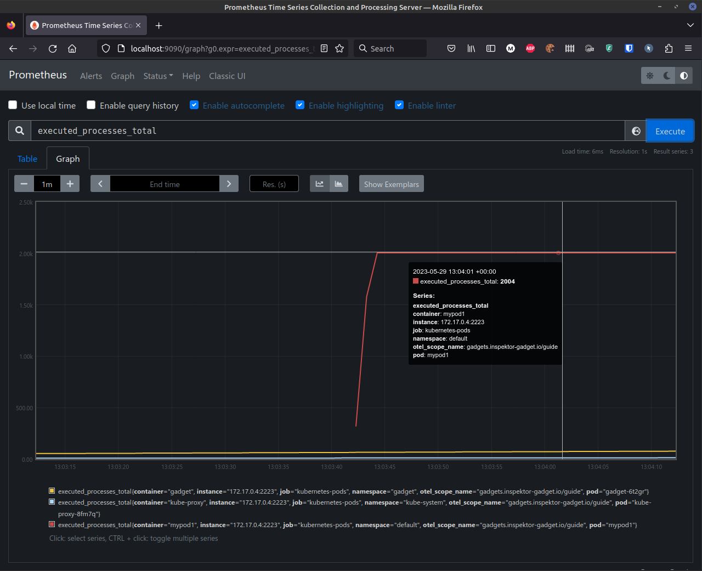
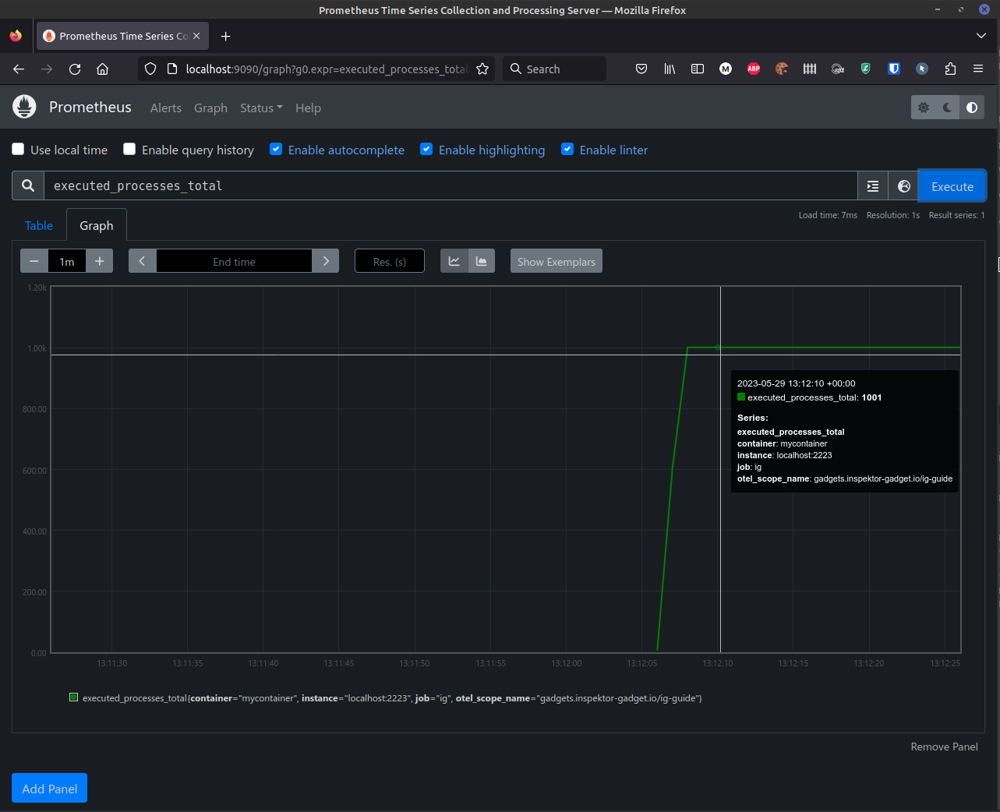
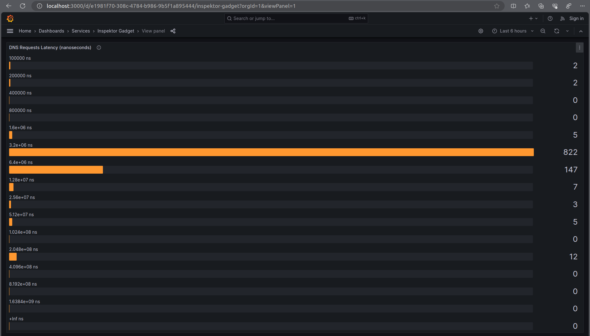

The Prometheus gadget collects and exposes metrics in Prometheus format. It's available in both, for
Kubernetes (`ig-k8s`) and in Linux hosts (`ig`).


```bash
$ kubectl gadget prometheus --metrics-config @<path>
$ ig prometheus --metrics-config @<path> --metrics-listen-address $IP:$PORT --metrics-path /metrics
```

## Configuration File

The configuration file defines the metrics to be exposed and their settings. The structure of this
file is:

```yaml
metrics_name: metrics_name
metrics:
  - name: metric_name
    type: counter or  gauge or histogram
    category: trace # category of the gadget to collect the metric. trace, snapshot, etc.
    gadget: exec # gadget used to collect the metric. exec, open, etc.
    selector:
      # defines which events to take into consideration when updating the metrics.
      # See more information below.
    labels:
      # defines the granularity of the labels to capture. See below.
```

### Filtering (aka Selectors)

It's possible to configure Inspektor Gadget to only update metrics for some specific labels. This is
useful to keep the cardinality of the labels low.

```yaml
  selector:
  - "columnName:value" # matches if the content of the column is equals to value
  - "columnName:!value" # matches if the content of the column is not equal to value
  - "columnName:>=value" # matches if the content of the column is greater and equal to value
  - "columnName:>value" # matches if the content of columnName is greater than the value
  - "columnName:<=value" # matches, if the content of columnName is lower or equal to the value
  - "columnName:<value" # matches, if the content of columnName is lower than the value
  - "columnName:~value" # matches if the content of column matches the regular expression 'value'.
                        # see https://github.com/google/re2/wiki/Syntax for more information on the syntax.
```

Some examples are:

Only metrics for default namespace

```yaml
selector:
  - k8s.namespace: default
```

Only events with retval != 0

```yaml
selector:
  - "retval:!0"
```

Only events executed by pid 1 by non root users

```yaml
selector:
  - "pid:0"
  - "uid:>=1"
```

### Counters

This is the most intuitive metric: "A _counter_ is a cumulative metric that represents a
single [monotonically increasing counter](https://en.wikipedia.org/wiki/Monotonic_function) whose
value can only increase or be reset to zero on restart. For example, you can use a counter to
represent the number of requests served, tasks completed, or errors." from
[https://prometheus.io/docs/concepts/metric_types/#counter](https://prometheus.io/docs/concepts/metric_types/#counter).

The following are examples of counters we can support with the existing gadgets. The first one
counts the number of executed processes by namespace, pod and container.

```yaml
metrics_name: my_metrics
metrics:
  - name: executed_processes
    type: counter
    category: trace
    gadget: exec
    labels:
      - k8s.namespace
      - k8s.podName
      - k8s.containerName
```

By default, a counter is increased by one each time there is an event, however it's possible to
increase a counter using a field on the event too.

Executed processes by pod and container in the default namespace

```yaml
metrics_name: metrics_name
metrics:
  - name: executed_processes
    type: counter
    category: trace
    gadget: exec
    labels:
      - k8s.podName
      - k8s.containerName
    selector:
      - "k8s.namespace:default"
```

Or only count events for a given command:

`cat` executions by namespace, pod and container

```yaml
metrics_name: metrics_name
metrics:
  - name: executed_cats # ohno!
    type: counter
    category: trace
    gadget: exec
    labels:
      - k8s.namespace
      - k8s.podName
      - k8s.containerName
    selector:
      - "comm:cat"
```

DNS requests aggregated by namespace and pod

```yaml
metrics_name: metrics_name
metrics:
  - name: dns_requests
    type: counter
    category: trace
    gadget: dns
    labels:
      - k8s.namespace
      - k8s.podName
    selector:
      - "qr:Q" # Only count query events
```

### Gauges

"A _gauge_ is a metric that represents a single numerical value that can arbitrarily go up and down"
from
[https://prometheus.io/docs/concepts/metric_types/#gauge](https://prometheus.io/docs/concepts/metric_types/#gauge).

Right now only snapshotters are supported.

Examples of gauges are:

Number of processes by namespace, pod and container.

```yaml
metrics_name: metrics_name
metrics:
  - name: number_of_processes
    type: gauge
    category: snapshot
    gadget: process
    labels:
      - k8s.namespace
      - k8s.podName
      - k8s.containerName
```

Number of sockets in `CLOSE_WAIT` state

```yaml
metrics_name: metrics_name
metrics:
  - name: number_of_sockets_close_wait
    type: gauge
    category: snapshot
    gadget: socket
    labels:
      - k8s.namespace
      - k8s.podName
      - k8s.containerName
    selector:
      - "status:CLOSE_WAIT"
```

### Histograms

"A _histogram_ samples observations (usually things like request durations or response sizes) and counts them in
configurable buckets. It also provides a sum of all observed values."
from [https://prometheus.io/docs/concepts/metric_types/#histogram](https://prometheus.io/docs/concepts/metric_types/#histogram).
We support the same bucket configuration as described in
[https://github.com/cloudflare/ebpf_exporter#histograms.](https://github.com/cloudflare/ebpf_exporter#histograms.)

Right now only trace gadgets are supported.

Example of histograms is:

Latency of DNS requests for all pods

```yaml
metrics_name: metrics_name
metrics:
  - name: dns_requests_latency
    type: histogram
    category: trace
    field: latency
    bucket:
      min: 0
      max: 10
      multiplier: 100000 # 0.1ms
      type: exp2
      unit: ns
    selector:
      - "qr:R" # Latency is only calculated for response events
```

### Guide

Let's see how we can use this gadget in different environments.

#### On Kubernetes

In this guide we'll use the Prometheus Service Discovery: it automatically detects the endpoints to
scrape metrics from.

If you already have a Prometheus instance running in your cluster, be sure you provide it with the
following configuration:

```yaml
scrape_configs:
  - job_name: 'kubernetes-pods'

    scrape_interval: 1s
    scrape_timeout: 1s

    kubernetes_sd_configs:
    - role: pod

    relabel_configs:
    - source_labels: [__meta_kubernetes_pod_annotation_prometheus_io_scrape]
      action: keep
      regex: true
    - source_labels: [__meta_kubernetes_pod_annotation_prometheus_io_scheme]
      action: replace
      target_label: __scheme__
      regex: (https?)
    - source_labels: [__meta_kubernetes_pod_annotation_prometheus_io_path]
      action: replace
      target_label: __metrics_path__
      regex: (.+)
    - source_labels: [__address__, __meta_kubernetes_pod_annotation_prometheus_io_port]
      action: replace
      target_label: __address__
      regex: ([^:]+)(?::\d+)?;(\d+)
      replacement: $1:$2
```

Otherwise, you can just apply the config provided with this guide:

```bash
$ kubectl apply -f docs/examples/prometheus.yaml
namespace/monitoring created
serviceaccount/prometheus created
clusterrole.rbac.authorization.k8s.io/discoverer created
clusterrolebinding.rbac.authorization.k8s.io/prometheus-discoverer created
configmap/prometheus-server-conf created
deployment.apps/prometheus created
```

Create a port-forward session to Prometheus:

```bash
$ kubectl port-forward --namespace monitoring deployment/prometheus 9090:9090 &
```

Let's create a metric that reports processes executed:

```yaml
# myconfig.yaml
metrics_name: guide
metrics:
  - name: executed_processes
    type: counter
    category: trace
    gadget: exec
    labels:
      - k8s.namespace
      - k8s.podName
      - k8s.containerName
```

Start the gadget

```bash
$ kubectl gadget prometheus --metrics-config @myconfig.yaml
INFO[0000] Running. Press Ctrl + C to finish
INFO[0000] minikube             | Publishing metrics...
```

<!-- markdown-link-check-disable-next-line -->
Now, the `executed_processes_total` counter is available in Prometheus http://localhost:9090/graph?g0.expr=executed_processes_total&g0.tab=0&g0.stacked=0&g0.show_exemplars=0&g0.range_input=1m:


You can see that the counters are already going up for some containers.

Let's create a pod to execute from more processes:

```bash
$ kubectl run mypod1 -it --image busybox --restart Never -- sh -c 'for i in $(seq 0 1 1000); do cat /dev/null ; ping -c 1 localhost > /dev/null; done'
```

If we check the counter again, we can see that it shows that our pod has executed a lot of processes:



Now, update the configuration file to only take into considerations executions of the `cat` binary:

```yaml
# myconfig.yaml
metrics_name: guide
metrics:
  - name: executed_processes
    type: counter
    category: trace
    gadget: exec
    labels:
      - k8s.namespace
      - k8s.podName
      - k8s.containerName
    selector:
     - "comm:cat"
```

Restart the gadget

```bash
$ kubectl gadget prometheus --metrics-config @myconfig.yaml
INFO[0000] Running. Press Ctrl + C to finish
INFO[0000] minikube             | Publishing metrics...
```

Create a new pod that executes processes:

```bash
$ kubectl run mypod2 -it --image busybox --restart Never -- sh -c 'for i in $(seq 0 1 1000); do cat /dev/null ; ping -c 1 localhost > /dev/null; done'
```

The counter only takes into consideration the cat commands now:


#### With `ig`

It's also possible to use the prometheus gadget without Kubernetes. In this case, we have to
configure Prometheus to point to the endpoint exposed by ig, it's `localhost:2223` by default:

```yaml
# prometheus.yaml
scrape_configs:
- job_name: ig
  scrape_interval: 1s
  static_configs:
  - targets:
    - localhost:2223
```

Start prometheus with above configuration (please refer to [docker
installation](https://prometheus.io/docs/prometheus/latest/installation/#using-docker) in case you
want to run prometheus in a container).

```bash
$ prometheus --config.file prometheus.yaml
```

Then, start the prometheus gadget with the same configuration as above Kubernetes section:

```bash
$ sudo ig prometheus --metrics-config @myconfig.yaml
INFO[0000] Running. Press Ctrl + C to finish
INFO[0000] Publishing metrics...
```

<!-- markdown-link-check-disable-next-line -->
You can check in http://localhost:9090/targets and check that the ig endpoint is reporting metrics:


Let's execute some commands inside a container:

```bash
docker run --rm -ti --name=mycontainer busybox sh -c 'for i in $(seq 0 1 1000); do cat /dev/null ; ping -c 1 localhost > /dev/null; done'
```

<!-- markdown-link-check-disable-next-line -->
We can see how the counter for `mycontainer` is increased in http://localhost:9090/graph?g0.expr=executed_processes_total&g0.tab=0&g0.stacked=0&g0.show_exemplars=0&g0.range_input=1m.



#### Grafana

It's possible to visualize the metrics in Grafana. As an example we will plot a histogram for DNS requests latency. We
can use the [docker compose file](../../tools/monitoring/docker-compose.yml) to prepare the environment:

```bash
$ pushd tools/monitoring
$ docker compose up -d
$ popd
```

<!-- markdown-link-check-disable-next-line -->
At this point, Grafana is available at http://localhost:3000 and Prometheus at http://localhost:9090. We can start `ig`
with the following configuration:

```bash
$ sudo ig prometheus --metrics-config @tools/monitoring/config/histogram.yaml
INFO[0000] Running. Press Ctrl + C to finish
```

Now, generate some DNS requests:

```bash
$ docker run --rm -ti busybox sh -c 'for i in $(seq 0 1 1000); do cat /dev/null ; nslookup -querytype=a microsoft.com. > /dev/null; done'
```

<!-- markdown-link-check-disable -->
We should now be able to see the visualized histogram
at: http://localhost:3000/d/e1981f70-308c-4784-b986-9b5f1a895444/inspektor-gadget?orgId=1&viewPanel=1
<!-- markdown-link-check-enable -->



### Limitations

- The `kubectl gadget` instance has to keep running in order to update the metrics.
- It's not possible to configure the metrics endpoint in ig-k8s
